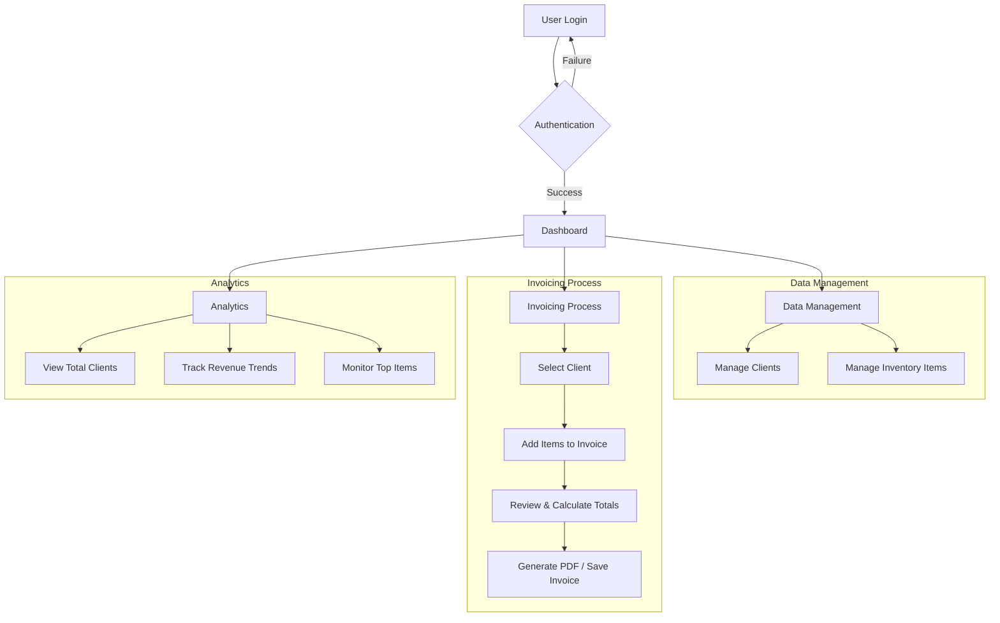

# Billety

Billety is a modern, cross‑platform billing and invoicing system designed for seamless business management. Built with **React**, **Electron**, and **Capacitor**, it delivers a unified experience across desktop (Windows/macOS/Linux) and mobile (Android). Billety simplifies your workflow by automatically generating tailored invoices, managing client databases, and tracking business performance in real-time.

---

## 🚀 Features

### **Unified Cross-Platform Experience**
- **Desktop**: Native-like performance on Windows, macOS, and Linux using Electron.
- **Mobile**: Robust Android application powered by Capacitor for on-the-go management.

### **Comprehensive Client Management**
- **Database**: Maintain detailed profiles for all your clients.
- **Tracking**: Keep tabs on contact details, receivables, and interaction history.

### **Advanced Invoice Operations**
- **Flexible Creation**: Generate professional invoices with dynamic line items.
- **Rate Customization**: Support for diverse billing models (e.g., rate per weight or per piece).
- **Status Monitoring**: Visual indicators for Paid, Unpaid, and Partially Paid statuses.

### **Automated & Custom Delivery**
- **Scheduling**: Set up automatic email delivery for invoices.
- **Templates**: Design personalized email templates to match your brand identity.

### **Real-Time Synchronization**
- **Cloud Sync**: Powered by Firestore to ensure your data is always up-to-date across all devices.
- **Offline Capability**: Continue working on mobile even without an internet connection; changes sync automatically when online.

### **Personalization**
- **Theming**: Toggle between elegant Light and Dark modes.
- **Localization**: Adapt the interface with pluggable language packs.

---

## 🔄 Application Flow



---

## 🛠️ Services Provided

- **Smart Invoicing Engine**: Automated tax calculations, sub-totals, and grand totals to eliminate manual errors.
- **Centralized Database**: A single source of truth for your Clients and Inventory items, accessible from anywhere.
- **Real-Time Collaboration**: Instant data updates across your organization's devices using **Firebase**.
- **Global Data Context**: Optimized application state management ensures smooth navigation and instant data availability without redundant loading.
- **Business Intelligence**: Interactive charts and visual analytics to provide deep insights into your business growth and user engagement.

---

## 🛠️ Tech Stack

| Layer          | Technology            |
| -------------- | --------------------- |
| UI Library     | React + TypeScript    |
| Desktop Shell  | Electron              |
| Mobile Shell   | Capacitor (Android)   |
| State & Sync   | Firebase Firestore    |
| Email Delivery | NodeMailer / SendGrid |
| Bundler        | Vite                  |

---

## 📦 Installation

1. **Clone the repository**

   ```bash
   git clone https://github.com/your‑org/billety.git
   cd billety
   ```

2. **Install dependencies**

   ```bash
   npm install
   ```

3. **Configure Firebase**

   - Copy `firebase.config.example.ts` to `firebase.config.ts`
   - Populate your Firebase project credentials

4. **Configure Email**

   - Copy `.env.example` to `.env`
   - Set SMTP or SendGrid API keys

---

## ⚙️ Development

### Desktop (Electron)

```bash
npm run dev:electron
```

- Spins up a Vite dev server for React UI
- Launches Electron with hot‑reload

### Mobile (Android via Capacitor)

```bash
npm run build
npx cap sync android
npx cap open android
```

- Builds web assets
- Syncs with Capacitor
- Opens Android Studio

### Shared Commands

| Command         | Description                         |
| --------------- | ----------------------------------- |
| `npm run dev`   | Run React in browser (for UI dev)   |
| `npm run build` | Build web assets (production ready) |
| `npm run test`  | Run unit & integration tests        |
| `npm run lint`  | Lint with ESLint + Prettier         |

---

## 🔒 Security & Permissions

- **Desktop**
  - File‑system access for exports/imports
  - No elevated privileges required

- **Mobile (Android)**
  - Network permission for Firestore & email delivery
  - File‑write permission for PDF exports

---

## 📄 License

This project is licensed under the [MIT License](LICENSE).

---

## 🙏 Acknowledgements

- [React](https://reactjs.org/)
- [Electron](https://www.electronjs.org/)
- [Capacitor](https://capacitorjs.com/)
- [Firebase](https://firebase.google.com/)

Feel free to open issues or reach out on Discord if you need help!
